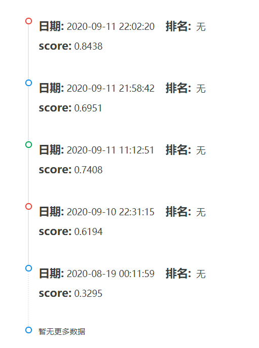
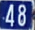

# char-recognition 街景字符识别
## 代码文件
- input文件夹
   用来存放数据集，从天池官网下载
- output文件夹
   保存之前训练好的模型和要提交的测试集标签文件
- code
   - character recognition.ipynb
   利用预训练模型ResNet18搭建神经网络模型，去除最后一个fc layer,并联5个fc layer用于分类。
   

## 实验总结
这次实践是天池上的一个字符识别比赛，数据集使用的是Google街景图像门牌号数据集SVHM，任务是识别不定长街景门牌字符。本赛题预测数字字符有这样一些特点：不可镜像，对位置敏感，这些在数据增强时需要考虑，不能翻转图片，resize也需要仔细考虑尺寸大小。
解决这个问题的思路可以有多种。一是当作图像分类问题，首先固定字符的长度，然后在CNN后添加多个全连接层进行多字符分类，按顺序把多个分支的结果连接，作为最终的结果输出。二是当作目标检测问题，首先检测出每张图片中的多个字符，然后按顺序把字符连接起来，作为最终的结果输出。
这个比赛给了一个baseline基础代码，格式是jupyter notebook。最后我的提交结果如下：

- 第一次实验：
使用baseline直接训练，batch_size=40，epoch=10,lr=0.001,优化器使用Adam，提交结果测试集准确率score=0.3295,分数很低。
我们发现baseLine中对训练集和测试集的预处理有一定差异，训练集和验证集是resize成（64，128），然后再随机裁剪成（60，120），而测试集是resize成（70，140），这就造成了测试集和训练集分布不一致，尺寸差异较大，超过了10%，导致模型在测试集上表现不佳。
- 第二次实验：
将测试集resize代码改为`transform.Resize(60,120)`之后，重新训练模型，提交结果为0.6194，得分提高了许多。我们看下训练10个epoch验证集的loss和acc变化：
```
Epoch: 0, Train loss: 3.201288181463877      Val loss: 3.6346988077163696      Val Acc: 0.3234
Epoch: 1, Train loss: 1.9820853635470073      Val loss: 3.010792998790741      Val Acc: 0.44
Epoch: 2, Train loss: 1.6244886504809062      Val loss: 2.765939730644226      Val Acc: 0.4758
Epoch: 3, Train loss: 1.4178793375492096      Val loss: 2.6497371077537535      Val Acc: 0.5069
Epoch: 4, Train loss: 1.2603404329617818      Val loss: 2.716396602153778      Val Acc: 0.4849
Epoch: 5, Train loss: 1.1504622252782186      Val loss: 2.5561904258728028      Val Acc: 0.5357
Epoch: 6, Train loss: 1.04843408370018          Val loss: 2.5777493786811827      Val Acc: 0.5415
Epoch: 7, Train loss: 0.9496217265923818      Val loss: 2.524811834573746      Val Acc: 0.5326
Epoch: 8, Train loss: 0.8733580025633176      Val loss: 2.6108505029678346      Val Acc: 0.5505
Epoch: 9, Train loss: 0.7865098938941956      Val loss: 2.607123359680176      Val Acc: 0.5523
best val acc: 0.5523
```
可以看出，train loss一直在快速下降，val loss在前6个epoch下降，val acc在上升，之后val loss在2.52到2.62之间不断振荡波动，val acc也在0.54附近振荡，这说明两个问题：
1）0.001的初始学习率是合适的，模型能快速降低损失；
2）后面几个epoch结果的振荡说明0.001的学习率较大，导致在极值附近波动，无法收敛。此时需要更小的学习率。
- 第三次实验
这次吸取教训，训练20个epoch，前10个epoch采用0.001的学习率，后10个epoch采用0.0001，遵循单一变量原则其他条件照旧，提交结果为0.7408。
```
Epoch: 0, Train loss: 3.6663593196868898 	 Val loss: 3.4419474391937257   Val Acc 0.3463
Epoch: 1, Train loss: 2.3542065817515057 	 Val loss: 2.98764915561676     Val Acc 0.4247
Epoch: 2, Train loss: 1.9631940975189208 	 Val loss: 2.876545383453369    Val Acc 0.4614
Epoch: 3, Train loss: 1.7285771380265553 	 Val loss: 2.8382968554496766   Val Acc 0.4854
Epoch: 4, Train loss: 1.5716067015329998 	 Val loss: 2.8798054842948915   Val Acc 0.4813
Epoch: 5, Train loss: 1.4408897026379903 	 Val loss: 2.5425176684856416   Val Acc 0.5209
Epoch: 6, Train loss: 1.3521415468056996 	 Val loss: 2.5747855396270753   Val Acc 0.5282
Epoch: 7, Train loss: 1.2600252989530563 	 Val loss: 2.4645020978450773   Val Acc 0.5402
Epoch: 8, Train loss: 1.1919125939210256 	 Val loss: 2.5220783369541167   Val Acc 0.5422
Epoch: 9, Train loss: 1.1224020988543828 	 Val loss: 2.543198872566223    Val Acc 0.5408
Epoch: 10, Train loss: 0.792724053601424 	 Val loss: 2.30143823158741     Val Acc 0.5942
Epoch: 11, Train loss: 0.7034239060084025  Val loss: 2.3542892869710923   Val Acc 0.5967
Epoch: 12, Train loss: 0.6644432981312275  Val loss: 2.3560139803886413   Val Acc 0.5954
Epoch: 13, Train loss: 0.6284131762186687  Val loss: 2.3327545924186706  Val Acc 0.6036
Epoch: 14, Train loss: 0.5939548565646012  Val loss: 2.355031459569931  Val Acc 0.6061
Epoch: 15, Train loss: 0.5612266014317672  Val loss: 2.4012033449411394  Val Acc 0.6034
Epoch: 16, Train loss: 0.54048728454113 	 Val loss: 2.461906110525131    Val Acc 0.6019
Epoch: 17, Train loss: 0.5130354589919249  Val loss: 2.5214106522798536  Val Acc 0.5997
Epoch: 18, Train loss: 0.49890879964828494 Val loss: 2.559582609653473   Val Acc 0.6027
Epoch: 19, Train loss: 0.47686505056420964 Val loss: 2.5544618825912475   Val Acc 0.6002
best Val acc: 0.6061
```
可以看到验证集在epoch14达到最佳效果，val acc达到了0.6061，所以学习率阶段下降的效果还是十分理想的！之后我再次尝试了下降到0.00001的学习率，发现val acc还是稳定在了0.60附近，并没有大提升了。
- 第4次实验
通过以上实验，我们发现了一个奇怪的现象,在测试集上的识别准确率往往比验证集上的更大！这是什么原因造成的呢？原来仍是训练验证集和测试集的差异造成的，如下图，第一张是训练集图片，第二张是测试集图片，测试集相比于训练集，图片中的字符尺寸较大，模型相对更容易识别一些，因此准确率较高。



训练测试集分布不一致，之前在预处理时将他们近乎resize成了同一尺寸大小，这可能是导致精度上不去的部分原因。因此，我们在预处理时将训练验证集时resize得更大一些，测试集resize得更小一些，这样能降低数据集之间的差异，如下：
```
# train & val:
transforms.Resize((80, 160))
transforms.RandomCrop((64, 128))
# test:
transforms.Resize((68, 128)) 
transforms.RandomCrop((64, 128))
```
重新进行训练，提交结果为0.8438，又提高了一些。
```
Epoch: 0, Train loss: 3.5294180612564086 	 Val loss: 3.244810375213623   Val Acc 0.3912
Epoch: 1, Train loss: 2.202888507048289 	 Val loss: 2.635691711902618   Val Acc 0.4961
Epoch: 2, Train loss: 1.8395386245250702 	 Val loss: 2.5104220263957977  Val Acc 0.5304
Epoch: 3, Train loss: 1.6459631496270497 	 Val loss: 2.225893362164497  Val Acc 0.5824
Epoch: 4, Train loss: 1.494177436153094 	 Val loss: 2.1664916849136353  Val Acc 0.5976
Epoch: 5, Train loss: 1.3837023535966873 	 Val loss: 2.125738975048065  Val Acc 0.6003
Epoch: 6, Train loss: 1.3018697028160096 	 Val loss: 2.0636153216362    Val Acc 0.6056
Epoch: 7, Train loss: 1.2266428709427515 	 Val loss: 2.119283670306206  Val Acc 0.5918
Epoch: 8, Train loss: 1.1652437179485957 	 Val loss: 1.9725671684741974  Val Acc 0.6291
Epoch: 9, Train loss: 1.0970606182813645 	 Val loss: 2.029893163919449   Val Acc 0.6306
Epoch: 10, Train loss: 0.8262242705623308 	 Val loss: 1.7680121359825134  Val Acc 0.6732
Epoch: 11, Train loss: 0.7309476576646169 	 Val loss: 1.7312923853397368  Val Acc 0.6782
Epoch: 12, Train loss: 0.6994230639338493 	 Val loss: 1.742491385936737   Val Acc 0.6781
Epoch: 13, Train loss: 0.6756872808734576 	 Val loss: 1.7386603453159333  Val Acc 0.6825
Epoch: 14, Train loss: 0.6535456823209922 	 Val loss: 1.8040859316587448  Val Acc 0.6783
Epoch: 15, Train loss: 0.629661685526371 	 Val loss: 1.7836576241254807  Val Acc 0.6813
Epoch: 16, Train loss: 0.6078850307166577 	 Val loss: 1.7564932507276536  Val Acc 0.6849
Epoch: 17, Train loss: 0.5840460170209408 	 Val loss: 1.7510903737545014  Val Acc 0.687
Epoch: 18, Train loss: 0.5780755890210469 	 Val loss: 1.8021193780899047  Val Acc 0.6842
Epoch: 19, Train loss: 0.5630644427339236 	 Val loss: 1.8113539083003998  Val Acc 0.6873
best Val acc 0.6873
```
## 总结
- 除了阶段学习率下降，数据增强等常用的一些训练手段，使训练测试集保持同一分布也是非常重要的一个手段。我们需要认真仔细分析数据集的特点，针对当前主要矛盾进行模型改进。
- 进一步的改进工作我想应该集中在使用更复杂的模型如ResNet34,ResNet50或者干脆使用目标检测的模型如SSD，yolo等，需要好一点的显卡。
